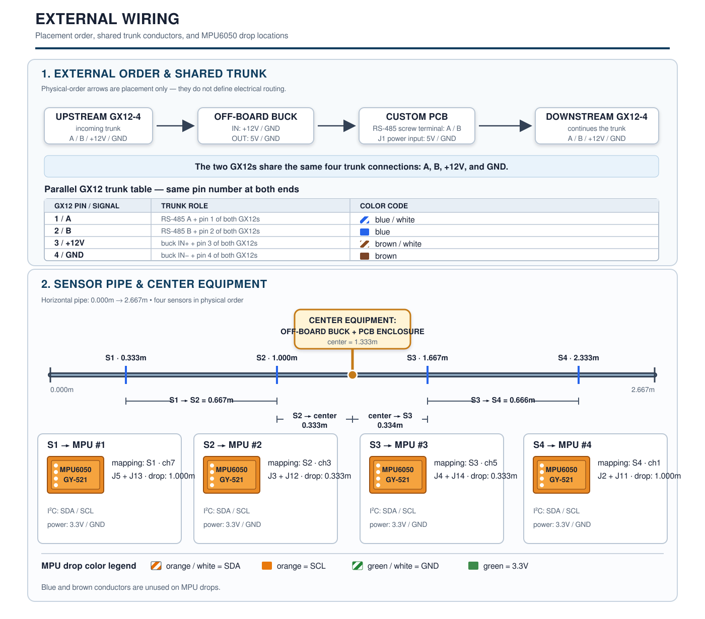

# Physical Build Spec

Internal board routing is defined by `excavision_pcb_design.zip`. This document
covers only placement and **off-board wiring**.



## Module layout

| Sensor | Position from top | TCA channel | Cable length |
|---|---:|---:|---:|
| S1 | 0.333 m | 7 | 1.000 m |
| S2 | 1.000 m | 3 | 0.333 m |
| S3 | 1.667 m | 5 | 0.333 m |
| S4 | 2.333 m | 1 | 1.000 m |

- Module pitch: **2.667 m**
- Sensor spacing: **66.67 cm**, including between modules
- PCB enclosure: near **1.333 m**
- GX12-4 male: top/upstream; GX12-4 female: bottom/downstream
- Use a separate latch/rail for weight; GX12 is not structural.

## MPU Cat6 drops

Only these four conductors connect to each MPU:

| Cat6 conductor | Signal |
|---|---|
| Orange/white | SDA |
| Orange | SCL |
| Green/white | GND |
| Green | 3.3 V |

PCB landing points:

| Sensor | Signal header | Power header |
|---|---|---|
| S1 / ch7 | J5: pin 1 SCL, pin 2 SDA | J13: pin 1 3.3 V, pin 2 GND |
| S2 / ch3 | J3: pin 1 SCL, pin 2 SDA | J12: pin 1 3.3 V, pin 2 GND |
| S3 / ch5 | J4: pin 1 SCL, pin 2 SDA | J14: pin 1 3.3 V, pin 2 GND |
| S4 / ch1 | J2: pin 1 SCL, pin 2 SDA | J11: pin 1 3.3 V, pin 2 GND |

Leave MPU XDA, XCL, AD0, and INT disconnected. Cat6 is custom wiring—never
connect it to Ethernet or PoE equipment.

## GX12-4 trunk and power

| GX12 pin | Signal | Node connection |
|---:|---|---|
| 1 | RS-485 A | blue/white Cat6 → RS-485 screw terminal A |
| 2 | RS-485 B | blue Cat6 → RS-485 screw terminal B |
| 3 | +12 V | brown/white Cat6 → external buck IN+ |
| 4 | GND | brown Cat6 → external buck IN− and common GND |

The **UPSTREAM and DOWNSTREAM GX12-4 connectors are wired in parallel**:
connect pin 1 to pin 1, pin 2 to pin 2, pin 3 to pin 3, and pin 4 to pin 4.
This lets the trunk continue through the node while also feeding this node.

The step-down converter is **off-board** and shared by both GX12 connectors:

```text
both GX12 pin 3/4 → external 12V→5V buck → PCB J1 pin 1=5V, pin 2=GND
both GX12 pin 1/2 → RS-485 module screw terminal A/B
```

Use the same GX12 pinout and Cat6 colors at both ends of every node.

## PCB checks before building more boards

The supplied KiCad files show:

- The RS-485 board/module has a screw terminal for the external A/B trunk.
  Solder the Cat6 A/B wires to that screw terminal; no extra PCB connector is
  required.
- U3 RO→GPIO34, DE+RE→GPIO32, and DI→GPIO33.
- U3 is powered from 3.3 V. A standard **MAX485/MAX485E requires 5 V**; fit a
  pin-compatible 3.3 V transceiver such as MAX3485, or revise the circuit.

## Electrician soldering checklist

1. Wire both GX12 connectors pin-for-pin in parallel: 1=A, 2=B, 3=+12 V,
   4=GND.
2. Use **blue/white=A, blue=B, brown/white=+12 V, brown=GND** for the trunk.
3. Solder A/B to the RS-485 module's screw terminal.
4. Solder buck output 5 V/GND to PCB J1 pin 1/2. Verify 5 V before connecting it.
5. Solder each MPU drop to its listed signal and power headers.
6. Check continuity and polarity before applying power.
7. Test each MPU on its assigned TCA channel, then test RS-485 with two nodes.
8. Enable all four sensors in `firmware/node/include/Config.h` before deployment.
