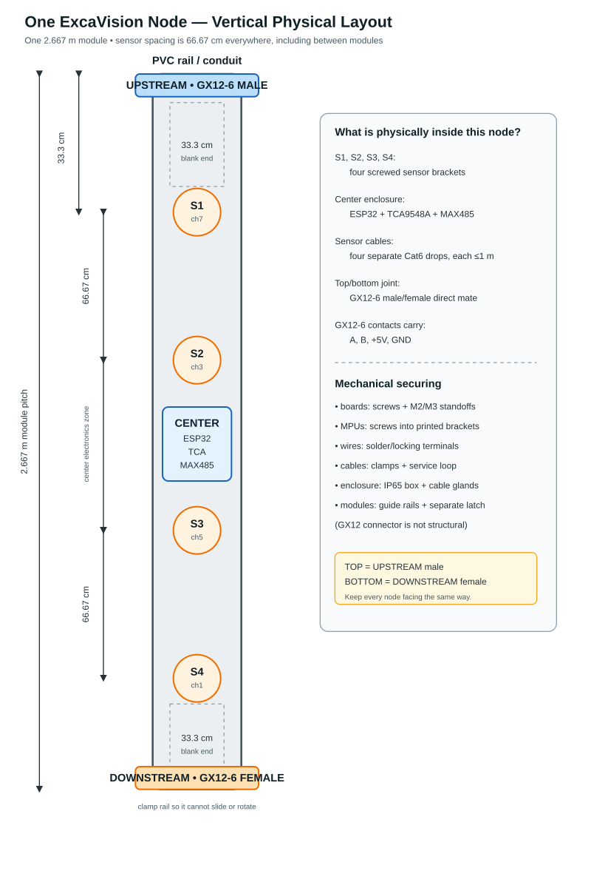
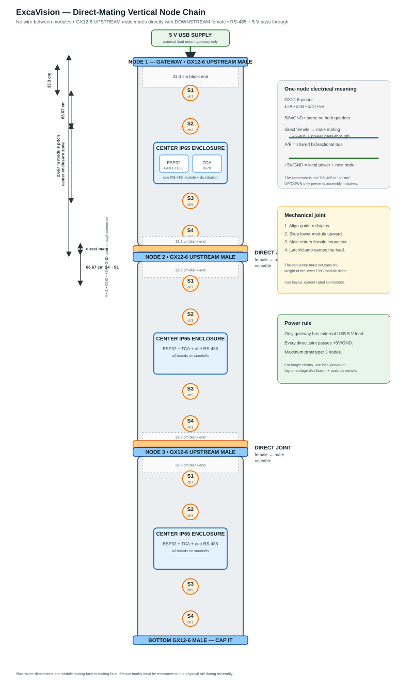
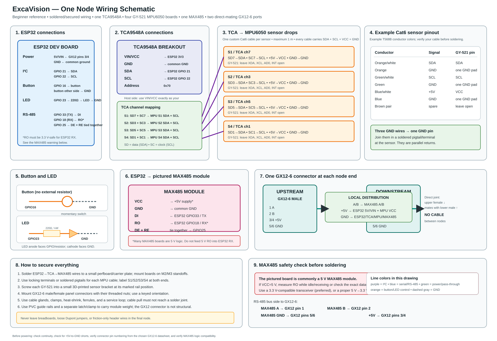
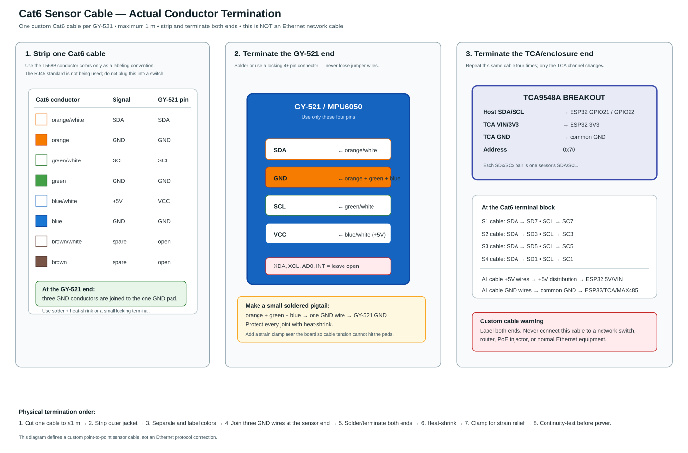
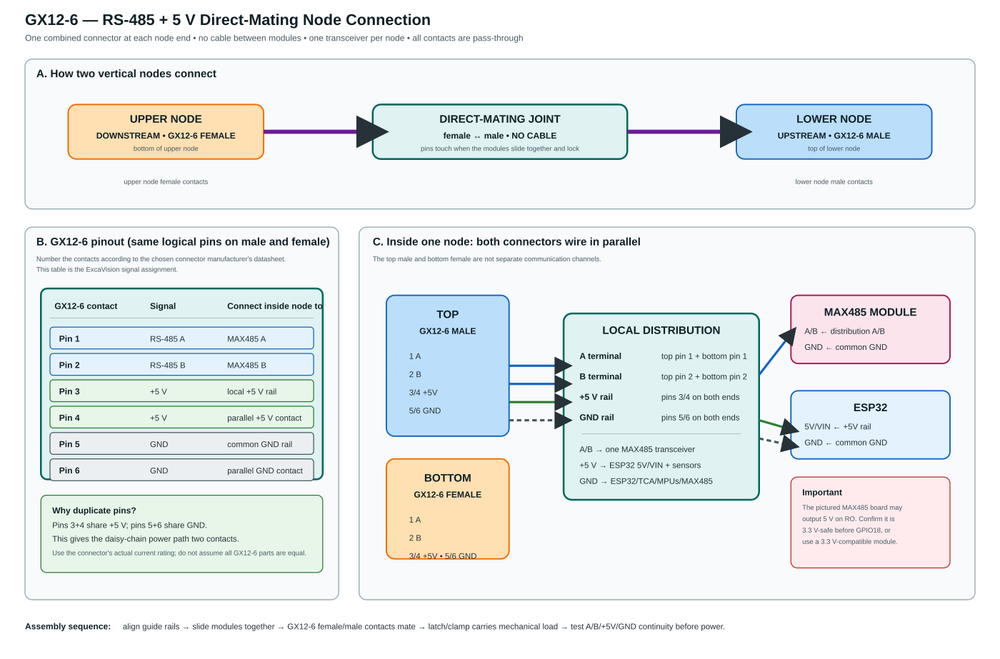
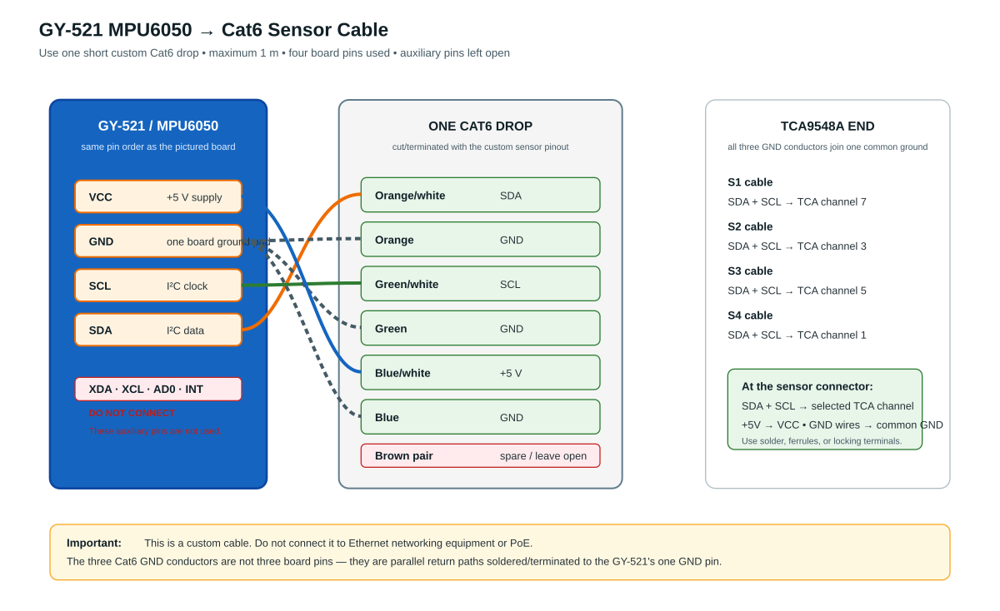
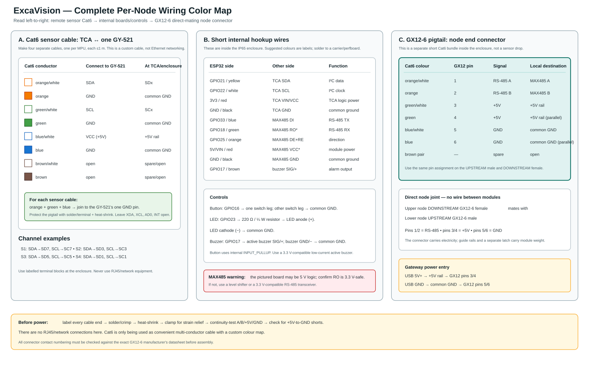

# ExcaVision Final Physical Build Spec

> This is the authoritative reproducible physical form for the current
> prototype. It supersedes earlier horizontal layout and spacing options.

## 1. Final vertical module geometry

### 1.0 Visual build references

These are embedded here so the team does not need to open separate documents.
The wiring diagrams are the practical assembly references; the written tables
in §3 are the authoritative pin assignments.

**One complete vertical node:**



**Direct-mating three-node chain:**



**Complete one-node wiring overview:**



**Cat6 conductor termination:**



**GX12-6 power and RS-485 termination:**



**GY-521 close-up wiring reference:**



**Complete conductor colour map:**



Each node is one vertical modular section with a total pitch of approximately
**2.667 m**. The sensing span is 2.000 m, with 33.3 cm of blank/connector
space at both ends.

```text
TOP / UPSTREAM
      │
      │ 33.3 cm blank end
      │
      ● S1  (0.333 m from module top)
      │
      │ 66.67 cm
      │
      ● S2  (1.000 m)
      │
      │ 66.67 cm
      │
      ● S3  (1.667 m)
      │
      │ 66.67 cm
      │
      ● S4  (2.333 m)
      │
      │ 33.3 cm blank end
      │
BOTTOM / DOWNSTREAM
```

The TCA9548A + ESP32 + RS-485 electronics enclosure is mounted at the
physical center, approximately 1.333 m from the top. The furthest sensors are
therefore 1.000 m from the TCA.

The firmware channel convention remains:

```text
S1 → TCA channel 7
S2 → TCA channel 3
S3 → TCA channel 5
S4 → TCA channel 1
```

### 1.1 Chaining spacing

Modules are mounted end-to-end in the vertical direction:

```text
Node 1 S4 at 2.333 m
       │
       │ 66.67 cm boundary gap
       │
Node 2 S1 at 3.000 m
```

The 33.3 cm blank end on Node 1 plus the 33.3 cm blank end on Node 2 creates
the 66.67 cm boundary spacing. This preserves 66.67 cm between **every
neighboring sensor**, including sensors belonging to different nodes.

The same module geometry works when another module is attached above or
below. The physical orientation must remain marked with `TOP/UPSTREAM` and
`BOTTOM/DOWNSTREAM` arrows.

Each module covers one vertical pitch (~2.667 m) on its pipe. Multiple pipes
at a site are independent chains; each pipe has its own RS-485 bus and its own
gateway at the surface, and the backend keys them by `pipe_id` under the site.

## 2. Recommended cheap materials

### Per node

- 2.667 m PVC electrical conduit, PVC cable trunking, or a similar rigid
  lightweight rail. A standard 3 m length can be cut down.
- One small IP65-rated plastic enclosure at the center for the ESP32, TCA,
  and RS-485 module.
- One ESP32 development board.
- One TCA9548A board at I²C address `0x70`.
- Four MPU6050/GY-521 sensor boards.
- One normally-open momentary push button.
- One external LED and one 220 Ω, ¼ W resistor.
- One low-current, 3.3 V-compatible active buzzer module.
- One 3.3 V-compatible RS-485 transceiver module, or the existing module only
  after confirming its RO output is safe for the ESP32's 3.3 V RX input.
- Four small sensor mounting brackets. These are the only parts that need to
  be 3D printed; do not print a 2.667 m enclosure.
- One threaded/locking **GX12-6 male** combined connector at the top,
  labelled `UPSTREAM`.
- One threaded/locking **GX12-6 female** combined connector at the bottom,
  labelled `DOWNSTREAM`.
- The connector carries RS-485 and pass-through power using this fixed pinout:
  `1=A`, `2=B`, `3=+5V`, `4=+5V`, `5=GND`, `6=GND`.
- Verify the exact GX12-6 part's contact-current rating before production;
  pins 3/4 and 5/6 are paralleled for the 5 V power path.
- Four sensor cable connectors, labelled `S1`, `S2`, `S3`, and `S4`.
- M2/M3 screws, nuts, and standoffs for the boards and sensor brackets.
- Cable glands, strain reliefs, heat-shrink tubing, ferrules, and cable ties.
- Printed distance marks and a `TOP` arrow on every module.

### Cables

There are two separate uses of Cat6 in one node:

1. **Four sensor drops:** one cable from the centre enclosure to each MPU,
   each no longer than 1 m. The conductor map is in §3.1.1.
2. **GX12-6 internal pigtails:** short stripped Cat6 bundles inside the centre
   enclosure from each GX12-6 connector to the local distribution terminals.
   This map is in §3.5. These are not cables between modules.

- One cable run per MPU, no longer than 1 m. Ethernet/Cat5e/Cat6 cable is
  suitable for these short sensor drops.
- **No cable between adjacent modules.** The keyed male/female combined end
  connectors mate directly and carry RS-485 plus pass-through power.
- One external USB 5 V power lead enters the gateway only; lower modules
  receive power through the direct-mating connector joints.
- Keep internal sensor drops and enclosure wiring secured so their weight
  cannot pull on boards or connectors.

Ethernet cable used for sensors or RS-485 has a **custom ExcaVision pinout**;
it must never be connected to a network switch, router, or PoE source.
Use labels and keyed connectors to prevent that mistake.

## 3. Electrical connection contract

### 3.1 MPU6050 cable: sensor pod ↔ TCA channel

Each sensor gets its own short cable and connector. Use terminal labels rather
than relying only on wire colors. See the clean visual wiring reference:
[mpu6050_cat6_wiring.svg](./mpu6050_cat6_wiring.svg) (PNG preview:
[mpu6050_cat6_wiring.png](./mpu6050_cat6_wiring.png)).

### 3.1.1 Exact Cat6 conductor table

Use one Cat6 cable for each MPU. The following is the custom ExcaVision
termination. These are **not Ethernet network connections**.

| Cat6 conductor colour | At GY-521 sensor end | At centre/TCA end |
|---|---|---|
| Orange/white | `SDA` pin | Selected channel `SDx` |
| Orange | `GND` pin | Common GND rail |
| Green/white | `SCL` pin | Selected channel `SCx` |
| Green | `GND` pin | Common GND rail |
| Blue/white | `VCC` pin (`+5V`) | `+5V` rail |
| Blue | `GND` pin | Common GND rail |
| Brown/white | Leave open | Leave open |
| Brown | Leave open | Leave open |

The orange, green, and blue solid conductors are all ground conductors. Join
those three wires into one soldered pigtail or terminal that lands on the
GY-521's **single GND pin**. They are parallel return paths, not three board
pins.

At the sensor end, use only:

```text
SDA, SCL, VCC, GND
```

Leave `XDA`, `XCL`, `AD0`, and `INT` open. Protect the soldered joints with
heat-shrink and add a cable clamp/service loop near the sensor.

### 3.1.2 Sensor-to-TCA channel table

Every sensor cable carries both `SDA` and `SCL`; only its selected TCA channel
changes:

| Sensor cable | Cat6 SDA | Cat6 SCL | TCA data pin | TCA clock pin |
|---|---|---|---|---|
| S1 | orange/white | green/white | `SD7` | `SC7` |
| S2 | orange/white | green/white | `SD3` | `SC3` |
| S3 | orange/white | green/white | `SD5` | `SC5` |
| S4 | orange/white | green/white | `SD1` | `SC1` |

The Cat6 +5V and all three Cat6 GND conductors from every cable go to the
node's common power distribution. The MPU board receives 5 V as currently
validated. I²C pull-up references must remain at 3.3 V; never pull SDA/SCL to
5 V.

### 3.2 TCA9548A ↔ ESP32

Inside the centre enclosure:

```text
TCA SDA  → ESP32 GPIO 21
TCA SCL  → ESP32 GPIO 22
TCA 3.3V → regulated 3.3V supply
TCA GND  → common GND
TCA address → 0x70
```

The TCA board and ESP32 are mounted on a small perfboard/carrier plate with
standoffs. No breadboard and no loose Dupont jumpers are allowed in the final
assembly.

### 3.3 ESP32 ↔ RS-485 transceiver

The locked firmware pins remain:

```text
ESP32 GPIO 33 (TX) → transceiver DI
ESP32 GPIO 18 (RX) ← transceiver RO
ESP32 GPIO 25       → transceiver DE and RE tied together
ESP32 GND           → transceiver GND
```

`DE` and `RE` must be physically tied together at the transceiver/module,
then connected to GPIO 25 through one secured wire. Use a transceiver whose
logic levels are compatible with the ESP32.

### 3.4 Node-to-node trunk — direct-mating GX12-6 shared bus

There is **one** RS-485 transceiver per node. `A` and `B` form a single shared
bidirectional bus; there is no separate “in” and “out” pair of conductors —
`A`/`B` are electrically the same everywhere on the chain.

```text
                        ┌── RS-485 module A
  TOP connector  A ─────┤
                        └── BOTTOM connector  A

                        ┌── RS-485 module B
  TOP connector  B ─────┤
                        └── BOTTOM connector  B

                        ┌── RS-485 module GND
  TOP connector  GND ───┤
                        └── BOTTOM connector  GND

                        ┌── local board power
  (5 V / GND) ──────────┤   TOP and BOTTOM power pass-through
```

For Lego-style physical chaining, use one fixed vertical connector convention:

```text
TOP / UPSTREAM       = GX12-6 male
BOTTOM / DOWNSTREAM  = GX12-6 female
```

The lower node's GX12-6 male `UPSTREAM` plugs directly into the upper node's
GX12-6 female `DOWNSTREAM`:

```text
upper node DOWNSTREAM female
             │
             └──── plugs into ──── lower node UPSTREAM male
```

There is **no cable between modules**. The connector is both the mechanical
joint and the electrical link. The labels and connector genders are assembly
conventions only: electrically both ports land on the same local `A`/`B`/`GND`
bus and the same single transceiver. Do not install two RS-485 modules per
node.

Use the complete GX12-6 wiring table in §3.5 below. It replaces the older
short pinout summary: both connector ends are wired to the same local
terminals, and only the transceiver's `A`/`B`/`GND` leave the enclosure.

### 3.5 Complete per-node wiring tables

#### ESP32 ↔ TCA9548A

| ESP32 connection | TCA9548A pin | Wire/function |
|---|---|---|
| GPIO 21 | `SDA` | I²C host data |
| GPIO 22 | `SCL` | I²C host clock |
| ESP32 `3V3` | `VIN`/`VCC` | TCA logic power |
| ESP32 `GND` | `GND` | common ground |
| — | `RESET`, `OE`, `A0`, `A1`, `A2` | leave at board defaults/open as applicable; address stays `0x70` |

Use the TCA board's labels, not a guessed header position. The TCA host bus
is only the short secured ESP32-to-TCA wiring inside the enclosure.

#### TCA9548A ↔ four Cat6 sensor cables

| Sensor | TCA channel | TCA data pin | TCA clock pin | Cat6 cable termination |
|---|---:|---|---|---|
| S1 | 7 | `SD7` | `SC7` | orange/white → SD7; green/white → SC7 |
| S2 | 3 | `SD3` | `SC3` | orange/white → SD3; green/white → SC3 |
| S3 | 5 | `SD5` | `SC5` | orange/white → SD5; green/white → SC5 |
| S4 | 1 | `SD1` | `SC1` | orange/white → SD1; green/white → SC1 |

For every cable, terminate the power conductors the same way:

```text
blue/white → +5V distribution → that GY-521 VCC
orange + green + blue → common GND distribution → that GY-521 GND
brown/white + brown → open/spare
```

#### ESP32 ↔ MAX485 module

| ESP32 | MAX485 module | Function |
|---|---|---|
| GPIO 33 / `TX` | `DI` | ESP32 transmits to RS-485 |
| GPIO 18 / `RX` | `RO` | MAX485 receives to ESP32 |
| GPIO 25 | `DE` and `RE` tied together | transmit/receive direction |
| `5V`/`VIN`* | `VCC` | module power |
| `GND` | `GND` | common ground |
| — | `A` | to GX12-6 pin 1 |
| — | `B` | to GX12-6 pin 2 |

`DE` and `RE` are physically joined together at the MAX485 module before one
secured wire goes to GPIO25. **The pictured MAX485 board may output 5 V on
`RO` when powered at 5 V.** Confirm the exact board is 3.3 V-safe or add a
level shifter/use a 3.3 V-compatible transceiver before connecting `RO` to
GPIO18.

#### Button, LED, and buzzer

| Part | First connection | Second connection | Notes |
|---|---|---|---|
| Momentary button | one leg → ESP32 GPIO16 | other leg → common GND | normally-open; internal `INPUT_PULLUP`, no external resistor |
| LED resistor | ESP32 GPIO23 | 220 Ω, ¼ W → LED anode (`+`) | current-limiting resistor in series |
| LED | LED cathode (`−`) | common GND | anode is driven through the resistor |
| Active buzzer | ESP32 GPIO17 → `SIG`/`+` | buzzer `GND`/`−` → common GND | low-current 3.3 V active buzzer |

The current firmware drives GPIO17 directly, so a bare passive piezo or
high-current 5 V buzzer requires a transistor driver and is not this wiring.
Solder these wires to the carrier board; do not use a breadboard.

#### GX12-6 direct-mating connector — both male and female

The **male UPSTREAM** and **female DOWNSTREAM** connectors use the same logical
pin assignment. Verify the physical contact numbering against the selected
GX12-6 manufacturer's datasheet; do not rely on viewing orientation alone.

| GX12-6 pin | Signal | Inside every node | Direct-mating purpose |
|---:|---|---|---|
| 1 | RS-485 `A` | MAX485 `A` | shared bus |
| 2 | RS-485 `B` | MAX485 `B` | shared bus |
| 3 | `+5V` | +5V distribution | power contact 1 |
| 4 | `+5V` | +5V distribution | parallel power contact 2 |
| 5 | `GND` | common GND distribution | return contact 1 |
| 6 | `GND` | common GND distribution | parallel return contact 2 |

```text
UPSTREAM male GX12-6       DOWNSTREAM female GX12-6
pin 1 A  ────────────────── pin 1 A
pin 2 B  ────────────────── pin 2 B
pin 3 +5V ───────────────── pin 3 +5V
pin 4 +5V ───────────────── pin 4 +5V
pin 5 GND ───────────────── pin 5 GND
pin 6 GND ───────────────── pin 6 GND
```

Inside one node, both end connectors are wired in parallel to the same
terminals. The connector joint carries the electrical connection; guide rails
and a separate latch/clamp carry the mechanical load.

#### GX12-6 internal Cat6 pigtail colour table

This is the wiring from the rear of **each** GX12-6 connector to the local
node distribution. Use the same logical pin assignment for the top male
`UPSTREAM` and bottom female `DOWNSTREAM` connector:

| Cat6 conductor colour | GX12-6 pin | Signal | Local destination |
|---|---:|---|---|
| Orange/white | 1 | RS-485 `A` | MAX485 `A` |
| Orange | 2 | RS-485 `B` | MAX485 `B` |
| Green/white | 3 | `+5V` | +5 V distribution |
| Green | 4 | `+5V` | +5 V distribution, parallel |
| Blue/white | 5 | `GND` | common GND distribution |
| Blue | 6 | `GND` | common GND distribution, parallel |
| Brown/white | — | spare | leave open |
| Brown | — | spare | leave open |

```text
GX12-6 pin 1 A       → MAX485 A
GX12-6 pin 2 B       → MAX485 B
GX12-6 pins 3 + 4    → +5V rail → ESP32 5V/VIN, MAX485 VCC, MPU VCC
GX12-6 pins 5 + 6    → GND rail → ESP32, TCA, MAX485, all MPUs
```

Do not confuse this with the sensor-drop map: the sensor Cat6 cables use
orange/white for SDA and green/white for SCL; the GX12-6 pigtails use those
conductors for RS-485 `A/B`. Label the cable purpose at both ends.

#### Gateway power entry

```text
5V USB supply positive → gateway +5V distribution → GX12 pins 3/4
5V USB supply ground   → gateway common GND       → GX12 pins 5/6
```

Only the gateway needs an external USB power lead. Lower nodes receive +5V and
GND through the direct GX12-6 joints.

## 4. Power architecture

The current low-cost choice is **top-fed 5 V USB power for up to three nodes
total**: one gateway plus two slaves.

```text
5 V USB supply → gateway local distribution
                ↓ direct GX12-6 joint
              slave 1 local distribution
                ↓ direct GX12-6 joint
              slave 2 local distribution
```

Each node branches the incoming `+5V` and `GND` locally to the ESP32, TCA,
MPU drops, and RS-485 module. The direct GX12-6 joint carries the power;
there is no cable between modules and no breadboard in the power path.

Use adequately thick power conductors and check the voltage at the furthest
node under load. If the chain grows beyond three nodes or the voltage drops,
use local USB power or distribute a higher voltage with a buck converter per
node instead of extending 5 V indefinitely.

## 5. Mechanical securing requirements

The final assembly must satisfy all of the following:

- MPU boards are screwed into rigid sensor brackets; orientation arrows are
  visible and consistent.
- Sensor brackets are fixed at the four printed marks: 0.333 m, 1.000 m,
  1.667 m, and 2.333 m.
- The center electronics enclosure is screwed or clamped to the PVC rail at
  1.333 m.
- ESP32, TCA, and RS-485 boards are mounted on standoffs or a carrier plate.
- All board headers are soldered. No Dupont jumpers, loose breadboard rows,
  or friction-only temporary connections remain.
- Cable ends use ferrules in screw terminals, or locking crimp connectors.
- Every external cable enters through a cable gland or strain relief.
- Sensor cables have a service loop and are clamped near the enclosure so a
  pull on the cable cannot reach the MPU solder joints or TCA connector.
- Combined GX12-6 RS-485/power connectors are threaded/locking, gendered,
  and physically labelled `UPSTREAM` (male) and `DOWNSTREAM` (female).
- Connectors are labelled at both ends with the signal names, not only with
  color.
- The PVC rail has clamps or mounting points so the module cannot rotate or
  slide after installation.
- The electronics enclosure is closed with its gasket installed; cable glands
  are tightened after testing.
- Hot glue may provide secondary strain relief, but it is not the primary
  mechanical attachment for a sensor or connector.

## 6. Resistor decision for the current prototype

The current prototype deliberately adds no extra I²C pull-up resistors and no
RS-485 termination resistors. The existing short sensor runs and current bench
setup work without them.

This is a deliberate v1 simplification, not a claim that every long RS-485
installation will behave identically. Phase C must validate the chosen
three-node cable length and wiring without those components.

## 7. Assembly procedure

1. Cut and mark the PVC module at 0.333 m, 1.000 m, 1.667 m, and 2.333 m.
2. Install the four labelled sensor brackets.
3. Mount the centre enclosure at 1.333 m.
4. Mount the ESP32, TCA, and RS-485 module on the carrier plate.
5. Solder and secure the TCA-to-ESP32 wiring.
6. Terminate each MPU cable at its labelled TCA connector and sensor pod.
7. Terminate the top and bottom RS-485/power connectors.
8. Check continuity and shorts with power disconnected.
9. Verify every MPU is on the intended TCA channel.
10. Apply power locally on the bench and verify the boot scan.
11. Align and directly mate `DOWNSTREAM GX12-6 female → UPSTREAM GX12-6 male`;
    there is no cable between modules.
12. Add the next module with the same vertical orientation and pitch.
13. Verify RS-485 discovery and polling before closing the enclosures.
14. Tighten cable glands, install covers, and re-test after mechanical movement.

## 8. Final physical acceptance criteria

- Four sensors are present at every node.
- Sensor-to-sensor spacing is 66.67 cm inside and across module boundaries.
- TCA-to-furthest-MPU cable distance is no more than 1 m.
- No breadboard or jumper wires remain.
- All connectors are labelled and mechanically strain-relieved.
- `UPSTREAM`/`DOWNSTREAM` orientation is obvious; male/female connectors mate
  directly with no wire between modules.
- A/B/GND continuity is correct from gateway to final node.
- The furthest node remains above its required 5 V operating voltage.
- A three-node chain runs the complete firmware test: readings, alerts,
  global baseline, threshold sync, and recovery.
