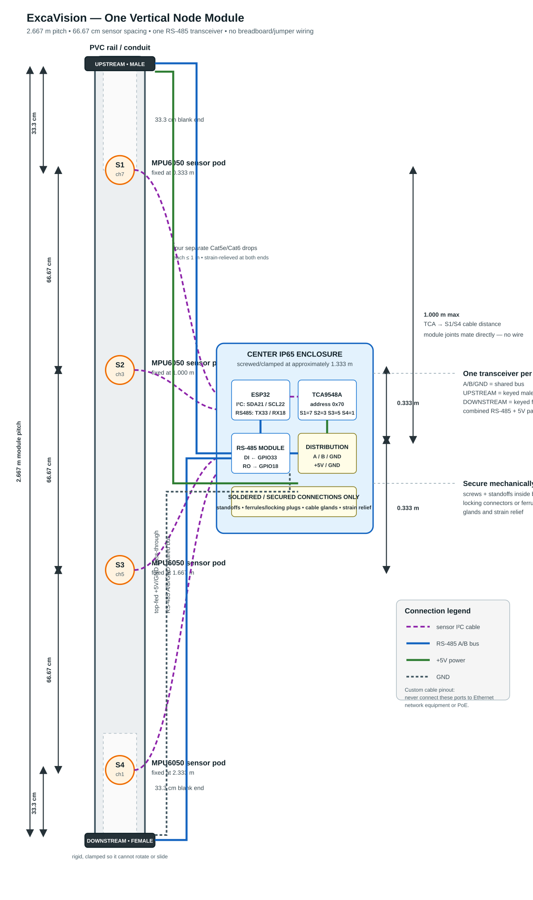
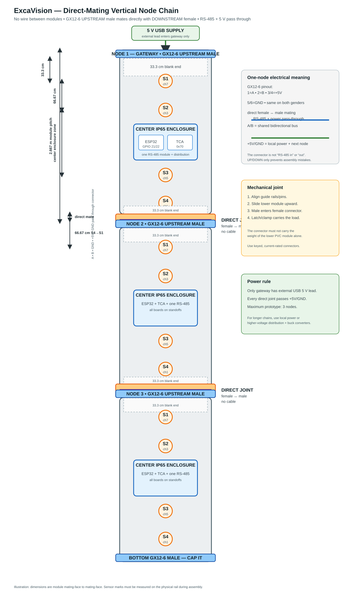

# ExcaVision Final Physical Build Spec

> This is the authoritative reproducible physical form for the current
> prototype. It supersedes earlier horizontal layout and spacing options.

## 1. Final vertical module geometry

### 1.0 Per-node assembly diagram

Use this as the primary physical reference. It shows **one complete node**
vertically: sensor positions, the center electronics enclosure, four MPU cable
runs, one RS-485 transceiver, passive `UPSTREAM`/`DOWNSTREAM` pass-through
ports, and the top-fed power pass-through.



For the chain-level view showing direct male/female mating between modules:



Each node is one vertical modular section with a total pitch of approximately
**2.667 m**. The sensing span is 2.000 m, with 33.3 cm of blank/connector
space at both ends.

```text
TOP / UPSTREAM
      │
      │ 33.3 cm blank end
      │
      ● S1  (0.333 m from module top)
      │
      │ 66.67 cm
      │
      ● S2  (1.000 m)
      │
      │ 66.67 cm
      │
      ● S3  (1.667 m)
      │
      │ 66.67 cm
      │
      ● S4  (2.333 m)
      │
      │ 33.3 cm blank end
      │
BOTTOM / DOWNSTREAM
```

The TCA9548A + ESP32 + RS-485 electronics enclosure is mounted at the
physical center, approximately 1.333 m from the top. The furthest sensors are
therefore 1.000 m from the TCA.

The firmware channel convention remains:

```text
S1 → TCA channel 7
S2 → TCA channel 3
S3 → TCA channel 5
S4 → TCA channel 1
```

### 1.1 Chaining spacing

Modules are mounted end-to-end in the vertical direction:

```text
Node 1 S4 at 2.333 m
       │
       │ 66.67 cm boundary gap
       │
Node 2 S1 at 3.000 m
```

The 33.3 cm blank end on Node 1 plus the 33.3 cm blank end on Node 2 creates
the 66.67 cm boundary spacing. This preserves 66.67 cm between **every
neighboring sensor**, including sensors belonging to different nodes.

The same module geometry works when another module is attached above or
below. The physical orientation must remain marked with `TOP/UPSTREAM` and
`BOTTOM/DOWNSTREAM` arrows.

Each module covers one vertical pitch (~2.667 m) on its pipe. Multiple pipes
at a site are independent chains; each pipe has its own RS-485 bus and its own
gateway at the surface, and the backend keys them by `pipe_id` under the site.

## 2. Recommended cheap materials

### Per node

- 2.667 m PVC electrical conduit, PVC cable trunking, or a similar rigid
  lightweight rail. A standard 3 m length can be cut down.
- One small IP65-rated plastic enclosure at the center for the ESP32, TCA,
  and RS-485 module.
- One ESP32 development board.
- One TCA9548A board at I²C address `0x70`.
- Four MPU6050/GY-521 sensor boards.
- One 3.3 V-compatible RS-485 transceiver module, or the existing module only
  after confirming its RO output is safe for the ESP32's 3.3 V RX input.
- Four small sensor mounting brackets. These are the only parts that need to
  be 3D printed; do not print a 2.667 m enclosure.
- One keyed/latching **male** trunk connector at the top, labelled
  `UPSTREAM`.
- One keyed/latching **female** trunk connector at the bottom, labelled
  `DOWNSTREAM`.
- The trunk connector carries RS-485 `A/B`, common `GND`, and pass-through
  `+5V`/power return; use enough pins for all conductors.
- Four sensor cable connectors, labelled `S1`, `S2`, `S3`, and `S4`.
- M2/M3 screws, nuts, and standoffs for the boards and sensor brackets.
- Cable glands, strain reliefs, heat-shrink tubing, ferrules, and cable ties.
- Printed distance marks and a `TOP` arrow on every module.

### Cables

- One cable run per MPU, no longer than 1 m. Ethernet/Cat5e/Cat6 cable is
  suitable for these short sensor drops.
- **No cable between adjacent modules.** The keyed male/female combined end
  connectors mate directly and carry RS-485 plus pass-through power.
- One external USB 5 V power lead enters the gateway only; lower modules
  receive power through the direct-mating connector joints.
- Keep internal sensor drops and enclosure wiring secured so their weight
  cannot pull on boards or connectors.

Ethernet cable used for sensors or RS-485 has a **custom ExcaVision pinout**;
it must never be connected to a network switch, router, or PoE source.
Use labels and keyed connectors to prevent that mistake.

## 3. Electrical connection contract

### 3.1 MPU6050 cable: sensor pod ↔ TCA channel

Each sensor gets its own short cable and connector. Use terminal labels rather
than relying only on wire colors.

Recommended use of one Ethernet cable for a sensor drop:

| Cable pair | Conductors |
| --- | --- |
| Pair 1 | `SDA` + `GND` |
| Pair 2 | `SCL` + `GND` |
| Pair 3 | `+5V` + `GND` |
| Pair 4 | spare |

At the sensor pod, connect to the MPU board's `VCC`, `GND`, `SDA`, and `SCL`.
The MPU board receives 5 V as currently validated. I²C pull-up references must
remain at 3.3 V; do not pull SDA/SCL to 5 V.

At the center enclosure, each cable terminates on a labelled screw terminal or
locking connector. The connector is then wired to the matching TCA channel:

```text
S1 cable → TCA channel 7
S2 cable → TCA channel 3
S3 cable → TCA channel 5
S4 cable → TCA channel 1
```

### 3.2 TCA9548A ↔ ESP32

Inside the centre enclosure:

```text
TCA SDA  → ESP32 GPIO 21
TCA SCL  → ESP32 GPIO 22
TCA 3.3V → regulated 3.3V supply
TCA GND  → common GND
TCA address → 0x70
```

The TCA board and ESP32 are mounted on a small perfboard/carrier plate with
standoffs. No breadboard and no loose Dupont jumpers are allowed in the final
assembly.

### 3.3 ESP32 ↔ RS-485 transceiver

The locked firmware pins remain:

```text
ESP32 GPIO 33 (TX) → transceiver DI
ESP32 GPIO 18 (RX) ← transceiver RO
ESP32 GPIO 25       → transceiver DE and RE tied together
ESP32 GND           → transceiver GND
```

`DE` and `RE` must be physically tied together at the transceiver/module,
then connected to GPIO 25 through one secured wire. Use a transceiver whose
logic levels are compatible with the ESP32.

### 3.4 Node-to-node trunk — single shared bus, gendered ports

There is **one** RS-485 transceiver per node. `A` and `B` form a single shared
bidirectional bus; there is no separate “in” and “out” pair of conductors —
`A`/`B` are electrically the same everywhere on the chain.

```text
                        ┌── RS-485 module A
  TOP connector  A ─────┤
                        └── BOTTOM connector  A

                        ┌── RS-485 module B
  TOP connector  B ─────┤
                        └── BOTTOM connector  B

                        ┌── RS-485 module GND
  TOP connector  GND ───┤
                        └── BOTTOM connector  GND

                        ┌── local board power
  (5 V / GND) ──────────┤   TOP and BOTTOM power pass-through
```

For Lego-style physical chaining, use one fixed vertical connector convention:

```text
TOP / UPSTREAM       = male connector
BOTTOM / DOWNSTREAM  = female connector
```

The lower node's male `UPSTREAM` plugs into the upper node's female
`DOWNSTREAM`:

```text
upper node DOWNSTREAM female
             │
             └──── plugs into ──── lower node UPSTREAM male
```

The labels and connector genders are assembly conventions only. Electrically
both ports land on the same local `A`/`B`/`GND` bus and the same single
transceiver. Do not install two RS-485 modules per node.

Inside each enclosure, distribute the bus with a small screw-terminal strip,
WAGO-style lever connector, tiny perfboard, or a small custom distribution
PCB later:

```text
A terminal ← transceiver A, top port A, bottom port A
B terminal ← transceiver B, top port B, bottom port B
GND        ← transceiver GND, top port GND, bottom port GND
5 V        ← local board power, bottom power pass-through
```

Only the transceiver's `A`/`B`/`GND` go into the node-to-node trunk. The
ESP32-side `DI`/`RO`/`DE` stay inside the enclosure.

## 4. Power architecture

The current low-cost choice is **top-fed 5 V USB power for up to three nodes
total**: one gateway plus two slaves.

```text
5 V USB supply, approximately 3 A
        │
        ├── Gateway local branch
        │
        └── DOWNSTREAM power pass-through
                │
              Slave 1 local branch
                │
                └── DOWNSTREAM power pass-through
                        │
                      Slave 2 local branch
```

Each node receives power through a screw terminal or locking connector, then
branches it locally to the ESP32, TCA, MPU drops, and RS-485 module. The power
trunk is never carried through a breadboard.

Use adequately thick power conductors and check the voltage at the furthest
node under load. If the chain grows beyond three nodes or the voltage drops,
use local USB power or distribute a higher voltage with a buck converter per
node instead of extending 5 V indefinitely.

## 5. Mechanical securing requirements

The final assembly must satisfy all of the following:

- MPU boards are screwed into rigid sensor brackets; orientation arrows are
  visible and consistent.
- Sensor brackets are fixed at the four printed marks: 0.333 m, 1.000 m,
  1.667 m, and 2.333 m.
- The center electronics enclosure is screwed or clamped to the PVC rail at
  1.333 m.
- ESP32, TCA, and RS-485 boards are mounted on standoffs or a carrier plate.
- All board headers are soldered. No Dupont jumpers, loose breadboard rows,
  or friction-only temporary connections remain.
- Cable ends use ferrules in screw terminals, or locking crimp connectors.
- Every external cable enters through a cable gland or strain relief.
- Sensor cables have a service loop and are clamped near the enclosure so a
  pull on the cable cannot reach the MPU solder joints or TCA connector.
- Combined RS-485/power connectors are keyed, gendered, and physically
  labelled `UPSTREAM` (male) and `DOWNSTREAM` (female).
- Connectors are labelled at both ends with the signal names, not only with
  color.
- The PVC rail has clamps or mounting points so the module cannot rotate or
  slide after installation.
- The electronics enclosure is closed with its gasket installed; cable glands
  are tightened after testing.
- Hot glue may provide secondary strain relief, but it is not the primary
  mechanical attachment for a sensor or connector.

## 6. Resistor decision for the current prototype

The current prototype deliberately adds no extra I²C pull-up resistors and no
RS-485 termination resistors. The existing short sensor runs and current bench
setup work without them.

This is a deliberate v1 simplification, not a claim that every long RS-485
installation will behave identically. Phase C must validate the chosen
three-node cable length and wiring without those components.

## 7. Assembly procedure

1. Cut and mark the PVC module at 0.333 m, 1.000 m, 1.667 m, and 2.333 m.
2. Install the four labelled sensor brackets.
3. Mount the centre enclosure at 1.333 m.
4. Mount the ESP32, TCA, and RS-485 module on the carrier plate.
5. Solder and secure the TCA-to-ESP32 wiring.
6. Terminate each MPU cable at its labelled TCA connector and sensor pod.
7. Terminate the top and bottom RS-485/power connectors.
8. Check continuity and shorts with power disconnected.
9. Verify every MPU is on the intended TCA channel.
10. Apply power locally on the bench and verify the boot scan.
11. Connect modules using `DOWNSTREAM female → UPSTREAM male` trunk connections.
12. Add the next module with the same vertical orientation and pitch.
13. Verify RS-485 discovery and polling before closing the enclosures.
14. Tighten cable glands, install covers, and re-test after mechanical movement.

## 8. Final physical acceptance criteria

- Four sensors are present at every node.
- Sensor-to-sensor spacing is 66.67 cm inside and across module boundaries.
- TCA-to-furthest-MPU cable distance is no more than 1 m.
- No breadboard or jumper wires remain.
- All connectors are labelled and mechanically strain-relieved.
- `UPSTREAM`/`DOWNSTREAM` orientation is obvious; male/female connectors mate
  directly with no wire between modules.
- A/B/GND continuity is correct from gateway to final node.
- The furthest node remains above its required 5 V operating voltage.
- A three-node chain runs the complete firmware test: readings, alerts,
  global baseline, threshold sync, and recovery.
