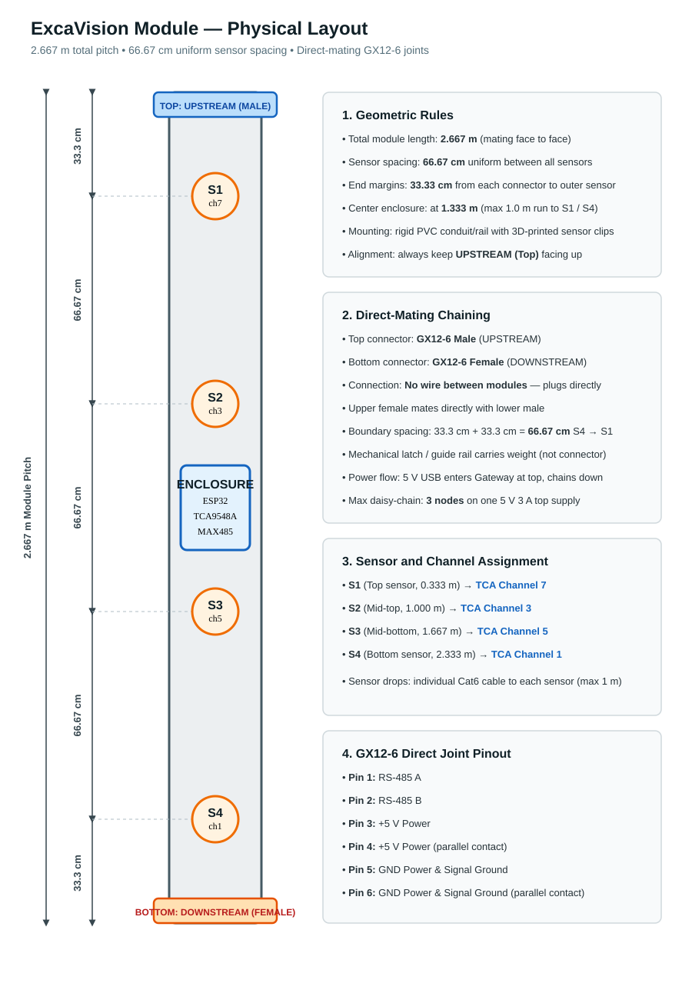

# ExcaVision Physical Build Spec

The authoritative build sheet. If the diagrams and tables disagree, the tables
win.

---

## 1. Module geometry (one node)

- Total module pitch (mating face to mating face): **2.667 m**
- Uniform sensor spacing: **66.67 cm**
- End margins: **33.33 cm** (connector → S1 / S4 → connector)
- Center enclosure at **1.333 m** — ESP32 + TCA9548A + MAX485
- Max sensor cable run from TCA: **1 m**
- Rails: PVC conduit; sensor clips: 3D printed; orientation arrow + `UPSTREAM` label always visible

| Sensor | Position from top | TCA channel |
|---|:---:|:---:|
| S1 | 0.333 m | 7 |
| S2 | 1.000 m | 3 |
| S3 | 1.667 m | 5 |
| S4 | 2.333 m | 1 |

Chaining: upper node's **DOWNSTREAM (female)** mates directly with lower
node's **UPSTREAM (male)** — no cable between modules. Boundary gap = 33.3 +
33.3 = **66.67 cm** S4→S1.

---

## 2. Bill of materials (per node)

- 2.667 m PVC conduit/rail
- IP65 enclosure (ESP32 + TCA9548A @ `0x70` + MAX485 + distribution)
- 1× ESP32 dev board
- 1× TCA9548A (I²C address 0x70)
- 4× MPU6050/GY-521
- 1× momentary push button
- 1× LED + 1× 220 Ω ¼ W resistor
- 1× low-current 3.3 V **active** buzzer
- 1× RS-485 transceiver module (**verify RO is 3.3 V-safe before wiring to GPIO18**)
- 1× GX12-6 **male** (TOP/UPSTREAM) + 1× GX12-6 **female** (BOTTOM/DOWNSTREAM), threaded/locking, current-rated
- 4× sensor cable connectors (Cat6/each, ≤1 m)
- M2/M3 screws/standoffs, cable glands, ferrules, heat-shrink, clamps, labels

---

## 3. Wiring (exact)

> Cat6 here is only used as **cheap multi-conductor cable with a custom color map** — never plug it into network/PoE gear. Label both ends.

### 3.1 ESP32 → TCA9548A

| ESP32 | TCA9548A |
|---|---|
| GPIO 21 | SDA |
| GPIO 22 | SCL |
| 3V3 | VIN/VCC |
| GND | GND |

Address pins left at board default → `0x70`.

### 3.2 Sensor drops — Cat6 to each MPU

| Cat6 color | GY-521 pin | TCA end |
|---|---|---|
| Orange/white | SDA | selected channel `SDx` |
| Orange | GND | common GND |
| Green/white | SCL | selected channel `SCx` |
| Green | GND | common GND |
| Blue/white | VCC (+5V) | +5V rail |
| Blue | GND | common GND |
| Brown/white | open | open |
| Brown | open | open |

Join orange + green + blue into one pigtail to the GY-521's single GND pin.
Leave XDA, XCL, AD0, INT open.

| Sensor | Channel pins |
|---|---|
| S1 | SD7 + SC7 |
| S2 | SD3 + SC3 |
| S3 | SD5 + SC5 |
| S4 | SD1 + SC1 |

### 3.3 ESP32 → MAX485

| ESP32 | MAX485 |
|---|---|
| GPIO 33 (TX) | DI |
| GPIO 18 (RX) | RO* |
| GPIO 25 | DE + RE (tied together) |
| 5V/VIN | VCC* |
| GND | GND |

`*` If the MAX485 is powered at 5 V, its RO may output 5 V — use a 3.3 V-safe
module or level shift. A/B bus terminal → GX12-6 pins 1/2.

### 3.4 Controls

| Part | Connection |
|---|---|
| Button | GPIO16 → one leg; other leg → GND (internal pull-up, no resistor) |
| LED | GPIO23 → 220 Ω → LED anode(+) ; cathode(−) → GND |
| Buzzer | GPIO17 → active-buzzer SIGNAL/+ ; buzzer − → GND |

### 3.5 GX12-6 node connectors (both genders, identical pinout)

| GX12-6 pin | Signal | Inside node → |
|---:|---|---|
| 1 | RS-485 A | MAX485 A |
| 2 | RS-485 B | MAX485 B |
| 3 | +5V | +5V rail |
| 4 | +5V | +5V rail (parallel) |
| 5 | GND | common GND |
| 6 | GND | common GND (parallel) |

Internal Cat6 pigtail colors: orange/white→pin1, orange→pin2, green/white→pin3,
green→pin4, blue/white→pin5, blue→pin6, brown pair spare.

Power in at gateway only: USB 5V+ → +5V rail → pins 3/4; USB GND → pins 5/6.

---

## 4. Assembly

1. Mark rail at 0.333 / 1.000 / 1.667 / 2.333 m; fit sensor clips; mount enclosure at 1.333 m.
2. Solder ESP32↔TCA↔MAX485 on the carrier plate; add button/LED/buzzer.
3. Terminate 4 Cat6 sensor drops (color map above); label S1–S4 both ends.
4. Wire GX12-6 male/female to distribution (A/B/+5V/GND).
5. Continuity + short-check before power; verify each MPU on its TCA channel.
6. Mate modules `DOWNSTREAM female → UPSTREAM male`; latch/guide carries the load; cap unused connector.
7. Boot, verify discovery/polling, then seal glands.

---

## 5. Power

Top-fed **5 V USB, ~3 A, max 3 nodes** (gateway + 2 slaves). Each node taps
the +5V/GND pass-through locally for ESP32/TCA/MPUs/MAX485. Beyond 3 nodes:
local USB per node or higher-voltage distribution + per-node buck.

---

## 6. Acceptance

- 4 sensors present; 66.67 cm spacing inside **and** across node boundaries.
- TCA→furthest sensor ≤ 1 m.
- No breadboards/jumpers; all connections soldered/locking + strain-relieved.
- A/B/GND continuity from gateway to last node; no shorts.
- Furthest node holds 5 V under load.
- 3-node chain passes entire firmware test (readings, alerts, baseline, threshold sync, recovery).